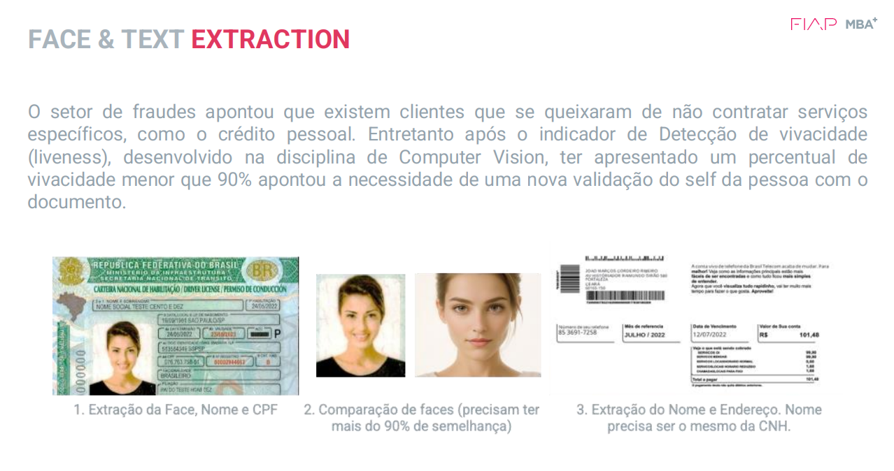

## 🚀 Detecção de Fraudes com Validação de Identidade  

### 📌 Descrição  
Este projeto tem como objetivo validar a identidade de clientes que alegam não ter contratado determinados serviços, como crédito pessoal.  
A validação ocorre por meio de **detecção de vivacidade (liveness)** e comparação de dados extraídos da **CNH (Carteira Nacional de Habilitação)** com informações do cliente.  

### 🔍 Como Funciona  
1. **Upload da CNH**: O usuário faz o upload da foto da sua CNH.  
2. **Extração de Dados**: São extraídos **Nome, CPF e Foto** do documento.  
3. **Captura de Selfie**: O cliente tira uma foto para comparação.  
4. **Comparação de Fotos**: O sistema compara a selfie com a foto da CNH para validar a identidade.  
5. **Validação Final**: Se houver correspondência, o sistema busca o **endereço do cliente** com base nos dados do documento.  

### Deploy: https://trabalhocognitiveenvironments-9tpxd8kakwfcankk4qvexf.streamlit.app/

